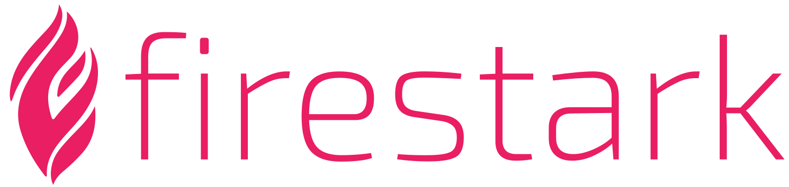

<br>


Firestark is a **non mvc PHP7 framework** which separates business logic from implementation logic. Firestark achieves this separation by giving you a special architecture that completly rids the business logic from outside dependencies. Instead the implementation logic is responsible for dependencies and speaks with the businnes logic to make a working application. This way the business logic becomes a very simple and readable layer to work in.


An example project can be found [here](https://github.com/firestark/goalstark)


## Getting started

1. Setup a virtual host pointing to the index.php inside the client directory.
2. In client/config.php correct the BASE URL.
3. Make sure the app can write inside the client/storage directory.
3. Run composer install inside the client directory.


### Example nginx vhost

```nginx
server {
    listen 80;
    listen [::]:80;

    server_name goalstark www.goalstark;

    root /home/username/Documents/goalstark®/client;
    index index.php;

    location / {
        try_files $uri $uri/ /index.php?$query_string;
    }

    location ~ \.php$ {
        include snippets/fastcgi-php.conf;
        fastcgi_pass unix:/var/run/php/php7.2-fpm.sock;
    }
}
```
