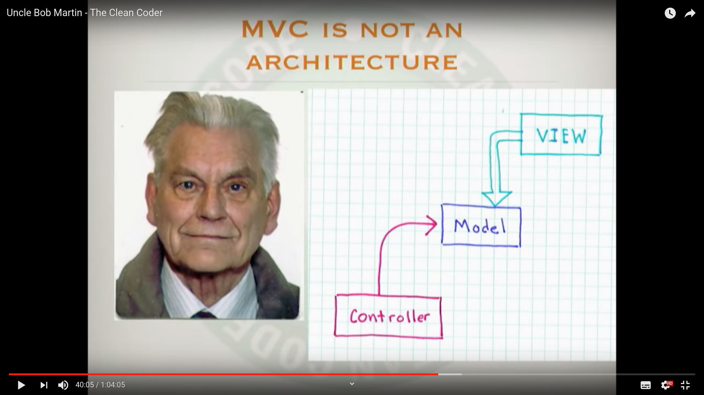

# Excellence in application architecture

## A good application architecture

In his presentation: [architecture the lost years](https://www.youtube.com/watch?v=NeXQEJNWO5w) Robert C Martin explains what a good application architecture is. First Martin explains that one of the major purposes of a good application architecture is immediately showing the application's intent. An application's intent can be seen by looking at it's use-cases. For that reason, the best way of clearly showing an application's intent is by placing the use-cases in their own directory at one of the top directories of that application. One of the advantages of an application that clearly shows it's intent is that it is easy to know what the application does. To illustrate, a new software engineer can join the team, look at the use-cases of the application and should immediately have a good idea of what the application does. Another advantage of clearly showing application intent becomes apparent when communicating the application's requirements to stakeholders. Because the use-cases are made very clear, you can easily check if the application does what the stakeholders expected it to do. A final advantage is that it is easier to locate where the use-cases do not enforce the needed requirements. This make it easy to correct the application when needed.

The second point Robert C. Martin suggests about application architecture is that it allows for major decisions to be deferred. Big choices like what database to choose and what delivery mechanism to use must be deferred for as long as possible. Deferral of big choices has some major benefits. First of all you don't have to concern yourself with the big choices right away and therefor you can focus on implementing the most important part first: The business logic. Second of all, you'll create more flexible code because of two reasons. A: You don't rely on exclusive features that a particular component offers to you. B: You won't be able to mix code from a particular component into your business logic. Components like databases and delivery mechanisms become like plug-ins to the business logic and these plug-ins can easily be swapped out later if needed. Third of all you'll be able to make better decisions on what components to actually use. If you have deferred major decisions and have implemented the business logic of your application you will have a better understanding of what components work most optimal with that business logic. For example: It will be much easier to decide whether to choose for a NOSQL document store or a relational database.

## Model View Controller (MVC)

A popular application architecture nowadays is Model, View, Controller (MVC). Originally MVC is not meant to be an application architecture. MVC is first invented as a UI related pattern that separates out user input, data and view into their own components. In MVC the model is not allowed to know where it gets it input from, in other words the model is not allowed to know what device is delivering the input, that is the job of the controller. Also the model is not allowed to know anything about the format that is used to deliver the data to the end user, that is the job of the view. With this separation the model is a reusable piece of code that can be used no matter what IO device is being used. 

MVC originates at small talk and is developed to structure out small components, like for example a radio button or a check-box, into triads of models, views and controllers. Each of these models, views and controllers has their own responsibility. The model keeps data related to the component and knows about some basic (business) rules to manipulate that data. The view consist of code to render the component on the screen based on the data from the model. The view listens for changes in the model and changes it's representation on the screen when the model's data changes. The controller listens for user input and translate those inputs into commands for the model with which the model can change it's data if applicable. To illustrate a button on the screen could have an MVC triplet:

-  A controller that listens for user input that corresponds to the button
- A model with some data and basic (business) rules that has something to do with that button
- A corresponding view that makes up the button on the screen based on the model

 When for example the user clicks on that button the controller receives a click event. The controller takes this click event and tells the model to update it's data. The view sees that the model has updated it's data and in response updates it's view of that data on the screen.

> [RegisFrey](https://commons.wikimedia.org/wiki/User:RegisFrey). (Designer). (2010).  *The model, view, and controller (MVC) pattern relative to the user.* [Digital image]. Retrieved from https://commons.wikimedia.org/wiki/File:MVC-Process.svg

### MVC as application architecture

MVC is a great pattern for what it is originally meant to do, namely separating data from input and output. Because MVC excelled so much  at what it did some developers started to think that MVC would also be a good fit to use as application architecture. Frameworks started to implement MVC as an overarching application architecture. All the application logic is separated into models, views and controllers. The model stores and retrieves data used by the application and applies (business) rules to storing and retrieving that data.  The view takes data from the models and displays this in some way to the end user. The controller takes in a user request and commands the model to update its state based on that request. There are however some differences when compared to the traditional MVC pattern. The first difference is that a controller acts as a bridge between the model and a view. The controller takes some user request, gathers all the data from that user request, then commands a model to update it's state using that gathered data, receives the updated state from that model and then commands the view to render with that updated state. The second difference is that a view no longer is one small component like a button or a check-box but instead is the entire screen. The view being the entire screen also means that there are multiple models being used to show that screen. So in conclusion we end up with a controller that talks to multiple models to receive some updated data and then passes that updated data into a view which is the entire screen.

#### Cons of using MVC as an application architecture

One of the major downsides of using MVC as an application architecture is not clearly showing application intent. When using MVC as application architecture you will see 3 directories in your application's project namely: models, views and controllers. This setup shows you that the application is build with the MVC architecture but tells you nothing about what the application is intended to do. 

Another downside of MVC as application architecture is the tendency to get large controllers. Controllers group different actions for one specific resource together. To illustrate: You could have a `TodoController`. That controller keeps all sorts of different actions about to-dos. Listing to-dos, creating to-dos, updating to-dos, viewing to-dos and deleting to-dos all are grouped together in this one controller.

A third con of using MVC as application architecture is that models group business logic together with implementation logic to persist application state. Models usually communicate via an ORM to a database or other persistence mechanism. Models are also the place to put business rules for that application state. With this setup your business rules are very tightly coupled to the technical persistence implementation.

A fourth downside of MVC as application architecture is that boundaries between models, views and controllers are not well enough defined. Controllers and views both want to call methods on the models. Because the models live so closely to the controllers and the view, it becomes very easy to write controller and view logic into the models. It's difficult to keep the separation right.

 

---------------------------------------------------------------------------------------------------------------------------------------------------------------------------------------

Drafts

---------------------------------------------------------------------------------------------------------------------------------------------------------------------------------------

`Example of such (business) rules are: A user-name may only occur once in the application and: Only a gold pass user may overdraw currency on his bank-account.`

The model is not allowed to know where it gets it input from, the model is not allowed to know what device is delivering the input, that is the job of the controller.

... Cons of MVC

- On a large scale, like application architecture, controller like logic seeps into the models, and model like logic seeps into the view leaving you with no clear separation. In MVC as an application architecture the views know about the models which your business logic resides in. The view should know nothing about the business logic. Controllers should not know about the business objects.
- MVC says nothing about what the application does (looking at the directory structure)
- The controllers group multiple actions together which can make controllers quite big
- With MVC your business logic becomes part of technical implementations like the IO channel (web) and the database. Technical implementations should be plug-ins to the business logic.
- Models hold your business logic, models also read and write to persistence, models may even include tasks related to data management, such as networking and data validation. This couples your business logic to all sorts of tasks it shouldn't be connected to
- Business procedures are better modeled using closures instead of objects
- View must only know how to present data to the user. They don't know or understand *what* they are presenting.
- ... Some logic doesn't clearly fit in either the model, view or controller. The result is that that code ends up in the controller.
- ... The boundaries between Business logic and Technical / Implementation logic are not well enough defined to keep the business logic separated from the Technical / Implementation logic
- The controller has a lot of responsibilities:
  - Unpack all the parameters that came from a request
  - Find the right model and pass the found parameters to the model
  - Take the models response and call the right view with the right parameters
  - Group all related actions on a resource together
- Not focused on the business logic
- No code reuse

## A business driven application architecture

... talk about how to setup a business driven application architecture

... Way too often you here lets choose this database, lets use this framework

... instead lets focus on the business requirements first

... BDD with focus on features

An example of this methodology can be seen in the firestark framework...

## Robert C Martin keynotes

- IO  - Device independence
- The web is a delivery mechanism
- The first thing i see: it's a rails app
- Architecture is about intent
- The web should be a plugin to the business rules
- A good architecture allows for (major) decisions to be deferred.

## References

Robert C. Martin. (Software engineer, Software Instructor). (2018). [architecture the lost years](https://www.youtube.com/watch?v=NeXQEJNWO5w)

https://cocoacasts.com/what-is-wrong-with-model-view-controller

[RegisFrey](https://commons.wikimedia.org/wiki/User:RegisFrey). (Designer). (2010).  *The model, view, and controller (MVC) pattern relative to the user.* [Digital image]. Retrieved from https://commons.wikimedia.org/wiki/File:MVC-Process.svg